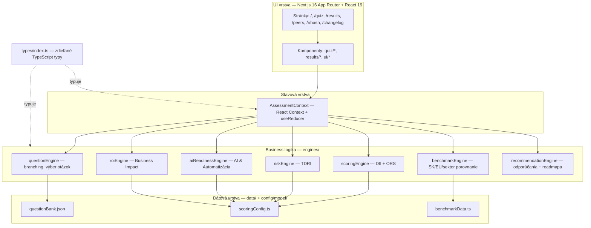
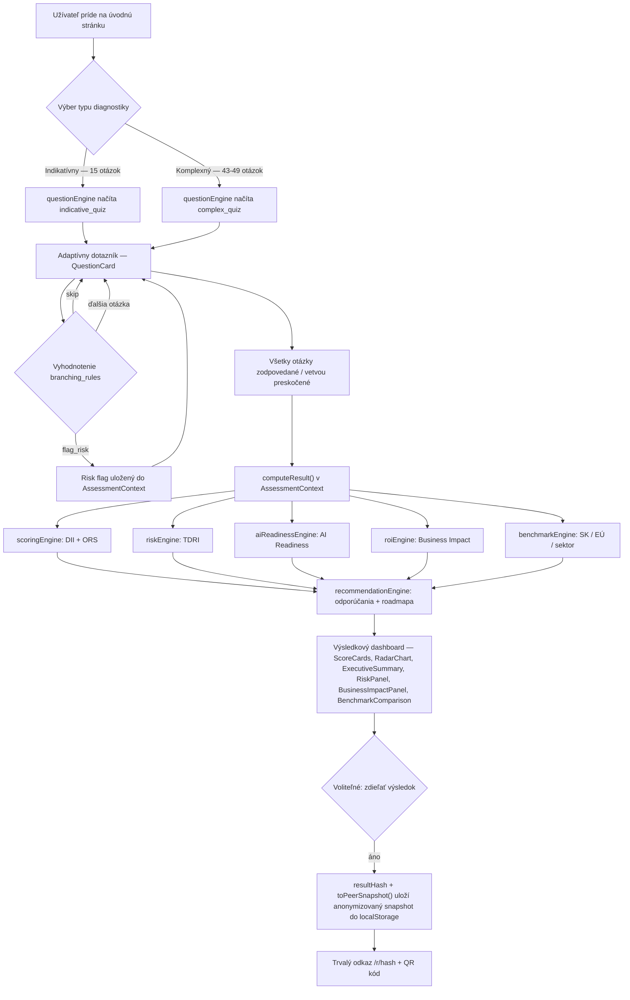

# digitalizuj.to

**Digitalna auditna platforma pre male a stredne podniky (SME)**

Metodicky obhajitelna platforma na meranie urovne digitalizacie firiem, identifikaciu rizik a generovanie prioritizovanych odporucani. Postavena na EU benchmark ramci (DII) a vlastnom Operational Digital Readiness Modeli.

> **Verzia:** 1.1.0 | **Stav:** Release | **Jazyk rozhrania:** Slovencina

---

## Co to robi

Firma vyplni adaptivny dotaznik (15 alebo 43-49 otazok) a dostane:

| Vystup | Rozsah | Ucel |
|--------|--------|------|
| **DII-Compatible Score** | 0-100 (+ prepocet 0-12) | Porovnanie s EU benchmark |
| **Operational Readiness Score** | 0-100 | Realna prevadzkova zrelost |
| **AI & Automatizacia Readiness** | 0-100 | Uroven vyuzitia AI a automatizacie |
| **Technical Debt & Risk Index** | 0-100 (vyssie = horsie) | Bezpecnostne a technologicke rizika |
| **Business Impact Potential** | hodiny/MD/EUR rocne | Odhad uspor s 3 scenarmi |

Vsetko bezi lokalne v prehliadaci — ziadne data sa neodosilaju na server.

---

## Dvojvrstvovy model

```
+---------------------------------------------------+
|                    VYSTUP                          |
+--------------------------+------------------------+
|  DII-Compatible Score    |  Operational Readiness  |
|  (adopcia nastrojov)     |  Score (realna zrelost) |
+--------------------------+------------------------+
|  Technical Debt & Risk Index (0-100)               |
|  = Samostatny penalizacny index                    |
+---------------------------------------------------+
|  Business Impact Potential                         |
|  = Transparentny odhad dopadu                      |
+---------------------------------------------------+
```

**DII Layer** — mapuje 12 indikatorov EU Digital Intensity Index na granularne skore.

**ODRM Layer** — meria 6 kategorii prevádzkovej zrelosti:

| Kat. | Oblast | Vaha |
|------|--------|------|
| A | Procesy a digitalizacia prace | 20 % |
| B | Systemy a integracie | 20 % |
| C | Data a reporting | 15 % |
| D | Infrastruktura a cloud | 15 % |
| E | Bezpecnost a technologicky dlh | 20 % |
| F | Governance a ludia | 10 % |

---

## Technologie

| Tech | Verzia | Ucel |
|------|--------|------|
| [Next.js](https://nextjs.org) | 16 | App Router, SSR/CSR |
| [React](https://react.dev) | 19 | UI framework |
| [TypeScript](https://www.typescriptlang.org) | 5 | Typovy system |
| [Tailwind CSS](https://tailwindcss.com) | 4 | Utility-first styling |
| [Recharts](https://recharts.org) | 3 | Radarovy graf |

---

## Architektura

### Technologicka architektura

Ako na seba naväzujú jednotlivé vrstvy — od UI po dátové súbory, ktoré poháňajú celý model:



**Kľúčové rozhodnutia:**
- **Žiadny backend, žiadna databáza** — celá aplikácia beží client-side v prehliadači; otázky, scoring aj benchmarky sú statické JSON/TS súbory bundlované s appkou.
- **Engines sú čisté funkcie** (`answers, questions -> Score`) — žiadny interný state, ľahko testovateľné a auditovateľné (audit trail = spätná rekonštrukcia z tých istých vstupov).
- **`config/model/` je editovateľná kópia** `data/` súborov pre netechnických editorov obsahu — synchronizácia je zatiaľ manuálna (viď `IMPROVEMENT_CHECKLIST.md`).

### Ako appka funguje (aplikačný tok)

Cesta jedného vyhodnotenia — od príchodu na stránku po zdieľateľný odkaz:



**Poznámky k toku:**
- Celý cyklus beží v jednom `useReducer` v `AssessmentContext.tsx` — žiadne API volania, žiadna latencia.
- Všetkých 6 engine výstupov (DII, ORS, TDRI, AI Readiness, Business Impact, Benchmark) sa počíta z rovnakej odpovedí sady nezávisle od seba — `recommendationEngine` ich až následne skladá do jedného odporúčacieho balíka.
- Zdieľaný odkaz (`/r/[hash]`) obsahuje len anonymizovaný agregát (skóre, kategórie) — nie jednotlivé odpovede; plný výsledok zostáva len v `localStorage` pôvodného prehliadača.

---

## Spustenie

```bash
# Klonovanie
git clone https://github.com/PRAESTAR/digitalizuj.git
cd digitalizuj

# Instalacie zavislosti
npm install

# Dev server
npm run dev

# Produkcny build
npm run build && npm start
```

Aplikacia bezi na `http://localhost:3000`.

---

## Struktura projektu

```
digitalizuj/
|
|-- app/                         # Next.js App Router stranky
|   |-- page.tsx                 # Hlavna stranka (hero, vyber kvizu)
|   |-- layout.tsx               # Root layout (header, footer, banner)
|   |-- globals.css              # Globalne styly, animacie, utility triedy
|   |-- quiz/page.tsx            # Kvizova stranka (adaptivny dotaznik)
|   |-- results/page.tsx         # Vysledkovy dashboard
|   +-- changelog/page.tsx       # Changelog stranka
|
|-- components/
|   |-- quiz/
|   |   |-- QuizSelector.tsx     # Vyber typu kvizu (indikativny/komplexny)
|   |   |-- QuestionCard.tsx     # Zobrazenie otazky + odpovede
|   |   +-- ProgressBar.tsx      # Progress bar s modulom
|   |
|   +-- results/
|       |-- ScoreCards.tsx       # 5 hlavnych skore kariet (DII, AI, ORS, TDRI, BIP)
|       |-- RadarChart.tsx       # Radarovy graf 6 ODRM kategorii
|       |-- ExecutiveSummary.tsx  # Silne stranky, rizika, quick wins
|       |-- RiskPanel.tsx        # TDRI vizualizacia risk faktorov
|       |-- BusinessImpactPanel.tsx  # ROI tabulka s 3 scenarmi
|       |-- Recommendations.tsx  # 3-fazova roadmapa odporucani
|       +-- BenchmarkComparison.tsx  # Porovnanie SK/EU/sektor/velkost
|
|-- context/
|   +-- AssessmentContext.tsx     # React Context — state management celeho kvizu
|
|-- engines/
|   |-- questionEngine.ts        # Branching logika, vyber dalsej otazky
|   |-- scoringEngine.ts         # DII + ORS vypocet, kategoriove skore
|   |-- riskEngine.ts            # TDRI vypocet, risk faktor evaluacia
|   |-- aiReadinessEngine.ts     # AI & Automatizacia Readiness vypocet
|   |-- roiEngine.ts             # Business impact vypocet, scenare
|   |-- benchmarkEngine.ts       # Porovnanie voči benchmark datam
|   +-- recommendationEngine.ts  # Generovanie prioritizovanych odporucani
|
|-- data/
|   |-- questionBank.json        # Matica otazok (indikativny + komplexny)
|   |-- scoringConfig.ts         # Vahy, prahy, risk faktory, ROI benchmarky
|   +-- benchmarkData.ts         # Benchmark data (SK/EU, sektory, velkosti)
|
|-- lib/
|   |-- resultHash.ts            # Generovanie/validacia hashu pre trvale odkazy
|   +-- snapshotMapper.ts        # ResultSnapshot -> anonymizovany PeerSnapshot
|
|-- config/model/                # Editovatelna konfiguracia modelu
|   |-- README.md                # Sprievodca priecinkom
|   |-- QUESTION_BANK_GUIDE.md   # Pokyny na editovanie matice otazok
|   |-- questionBank.json        # Kopia matice (na externu editaciu)
|   |-- scoringConfig.json       # Scoring parametre (JSON format)
|   |-- benchmarkData.json       # Benchmark data (JSON format)
|   |-- METHODOLOGY.md           # Metodika merania
|   |-- SCORING_SPEC.md          # Specifikacia scoringu
|   |-- ROI_MODEL.md             # Model business dopadu
|   |-- BENCHMARK_SPEC.md        # Specifikacia benchmarkov
|   +-- RECOMMENDATION_RULES.md  # Pravidla pre odporucania
|
|-- types/
|   +-- index.ts                 # TypeScript typy a interfaces
|
|-- METHODOLOGY.md               # Kompletna metodika (root)
|-- SCORING_SPEC.md              # Scoring specifikacia (root)
|-- ROI_MODEL.md                 # ROI model (root)
|-- BENCHMARK_SPEC.md            # Benchmark spec (root)
|-- RECOMMENDATION_RULES.md      # Pravidla odporucani (root)
|-- ARCHITECTURE.md              # Architektura systemu
+-- CHANGELOG.md                 # Historia zmien
```

---

## Klucove vlastnosti

### Adaptivny dotaznik
- **Indikativny kviz** — 15 otazok, 5-7 minut, rychly screening
- **Komplexny kviz** — 43-49 otazok (adaptivne, z 50 definovanych v banke), 15-20 minut, hlbsia diagnostika
- Branching logika (`action: skip` / `flag_risk` na `branching_rules`) — otazky sa prisposobuju odpovediam
- Moznost "Neviem" pri kazdej otazke s transparentnym handlingom

### Scoring engine
- **5 nezavislych vystupov** — DII, ORS, AI & Automatizacia Readiness, TDRI, Business Impact
- **Bezpecnostna penalizacia** — ak kategoria E < 30 bodov, ORS sa penalizuje az -30 %
- **14 risk faktorov** (RF01-RF14) s critical/high/medium severity
- Kazde skore je spatne rozlozitelne na odpovede a pravidla (audit trail)

### Dashboard
- Score cards s gradient vizualizaciou
- Radarovy graf 6 kategorii
- Executive summary (silne stranky, rizika, quick wins)
- Business impact tabulka s 3 scenarmi (konzervativny/stredny/optimisticky)
- 3-fazova roadmapa odporucani (okamzite/strategicke/transformacne)
- Benchmark porovnanie (SK vs. EU27, sektor, velkost)

### Konfiguracia modelu
Vsetky parametre su v editovatelnych suboroch v `config/model/`:
- Matica otazok (JSON) — texty, options, score, branching
- Scoring parametre (JSON) — vahy, prahy, risk faktory
- Benchmark data (JSON) — krajiny, sektory, velkosti
- Metodicka dokumentacia (MD) — kompletne vysvetlenie logiky

---

## Benchmark data

| Zdroj | Pokrytie | Rok |
|-------|----------|-----|
| Eurostat `isoc_e_dii` (DII v3) | DII distribúcia SK/EU27 (prieskum 2025) | 2025 |
| Digital Decade Report 2026 | Kontextove KPI (cloud, AI, SME intenzita) | 2026 |
| Expertne odhady | ORS mediany, sektorove/velkostne mediany, mikrofirmy | rev. 2026-07 |

**Zname obmedzenia:**
- Eurostat nepokryva firmy < 10 zamestnancov
- ORS, sektorove a velkostne benchmarky su expertne odhady, nie empiricke
- DII verzia premennych rotuje kazde 2 roky (v4/2024 vs. v3/2025) — data su ukotvene na jeden prieskumny rok
- Benchmark sa aktualizuje rocne podla publikacie Eurostatu (december)

---

## Metodicka dokumentacia

| Dokument | Obsah |
|----------|-------|
| `METHODOLOGY.md` | Dvojvrstvovy model, 6 kategorii, maturity skaly, principy |
| `SCORING_SPEC.md` | DII vypocet, ORS vahy, TDRI vzorce, penalizacie |
| `ROI_MODEL.md` | Business impact vzorce, scenare, confidence level |
| `BENCHMARK_SPEC.md` | Zdroje benchmarkov, vypocty porovnani |
| `RECOMMENDATION_RULES.md` | Pravidla generovania odporucani, prioritizacia |
| `ARCHITECTURE.md` | Technicka architektura systemu |

---

## Ako editovat maticu otazok

1. Otvorte `config/model/questionBank.json`
2. Precitajte si `config/model/QUESTION_BANK_GUIDE.md` (podrobne pokyny)
3. Upravte texty, options, score hodnoty
4. Importujte upraveny subor spat do `data/questionBank.json`

Podpora typov otazok: `single_choice`, `multi_select`

---

## Roadmap

- [ ] Verifikacne otazky pre self-reported data
- [ ] Dynamicke benchmarky z vlastnych dat (po 500+ hodnoteniach)
- [ ] Sektorove normalizacne profily
- [ ] Export vysledkov do PDF
- [ ] Simple payback period kalkulacia
- [ ] Regionalne benchmarky (SK kraje)
- [ ] Multi-language podpora

---

## Licencia

Proprietary. (c) PRAESTAR.

---

<sub>Verzia: 1.1.0 | Metodika: DII-Compatible + ODRM v1.4-MVP | Benchmark: Eurostat DII 2025 (isoc_e_dii, 2025-DII-v3)</sub>
